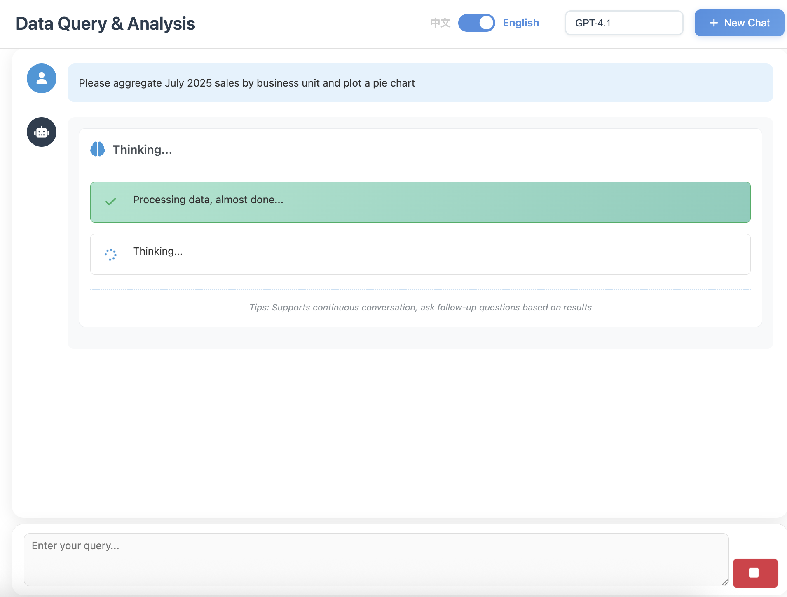
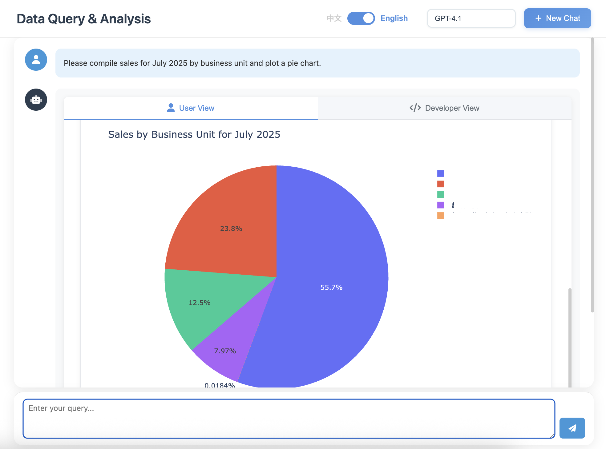

<div align="center">
  
  
  
  <br/><br/>
  
  **[Documentation](docs/README_CN.md)** : [🇨🇳](docs/README_CN.md) | 🇬🇧
  
  <br/>
  
  [](LICENSE)
  [](https://www.python.org/)
  [](https://github.com/OpenInterpreter/open-interpreter)
  [](https://github.com/MKY508/QueryGPT/stargazers)
  
  <br/>
  
  <h3>An intelligent data analysis Agent based on OpenInterpreter</h3>
  <p><i>Chat with your database in natural language</i></p>
  
</div>

<br/>

---

## ✨ Core Advantages

**Think Like a Data Analyst**
- **Autonomous Exploration**: Proactively examines table structures and sample data when encountering issues
- **Multi-round Validation**: Re-checks when anomalies are found to ensure accurate results
- **Complex Analysis**: Not just SQL, can execute Python for statistical analysis and machine learning
- **Visible Thinking**: Real-time display of Agent's reasoning process (Chain-of-Thought)

## 📸 System Screenshots

<table>
  <tr>
    <td align="center">
      
      <b>Real-time AI Thinking Process</b>
    </td>
  </tr>
  <tr>
    <td align="center">
      
      <b>Interactive Data Visualization</b>
    </td>
  </tr>
  <tr>
    <td align="center">
      
      <b>Transparent Code Execution</b>
    </td>
  </tr>
</table>

## 🌟 Key Features

### Agent Core Capabilities
- **Autonomous Data Exploration**: Agent proactively understands data structure and explores relationships
- **Multi-round Reasoning**: Like an analyst, investigates deeply when issues arise
- **Chain-of-Thought**: Real-time display of Agent's thinking process, intervention possible anytime
- **Context Memory**: Understands conversation history, supports continuous multi-round analysis

### Data Analysis Capabilities
- **SQL + Python**: Not limited to SQL, can execute complex Python data processing
- **Statistical Analysis**: Automatic correlation analysis, trend prediction, anomaly detection
- **Chinese Business Terms**: Native understanding of YoY, MoM, retention, repurchase concepts
- **Smart Visualization**: Automatically selects best chart type based on data characteristics

### System Features
- **Multi-model Support**: Switch freely between GPT-5, Claude, Gemini, Ollama local models
- **Flexible Deployment**: Supports cloud API or Ollama local deployment, data never leaves premises
- **History Records**: Saves analysis process, supports backtracking and sharing
- **Data Security**: Read-only permissions, SQL injection protection, sensitive data masking
- **Flexible Export**: Supports Excel, PDF, HTML and other formats

## 📦 Technical Requirements

- Python 3.10.x (Required, OpenInterpreter 0.4.3 dependency)
- MySQL or compatible database

<br/>

## 📊 Product Comparison

| Comparison | **QueryGPT** | Vanna AI | DB-GPT | TableGPT | Text2SQL.AI |
|------------|:------------:|:--------:|:------:|:--------:|:-----------:|
| **Cost** | **✅ Free** | ⭕ Has paid version | ✅ Free | ❌ Paid | ❌ Paid |
| **Open Source** | **✅** | ✅ | ✅ | ❌ | ❌ |
| **Local Deployment** | **✅** | ✅ | ✅ | ❌ | ❌ |
| **Execute Python Code** | **✅ Full environment** | ❌ | ❌ | ❌ | ❌ |
| **Visualization** | **✅ Programmable** | ⭕ Preset charts | ✅ Rich charts | ✅ Rich charts | ⭕ Basic |
| **Chinese Business Understanding** | **✅ Native** | ⭕ Basic | ✅ Good | ✅ Excellent | ⭕ Basic |
| **Agent Autonomous Exploration** | **✅** | ❌ | ⭕ Basic | ⭕ Basic | ❌ |
| **Real-time Thinking Display** | **✅** | ❌ | ❌ | ❌ | ❌ |
| **Extensibility** | **✅ Unlimited** | ❌ | ❌ | ❌ | ❌ |

### Our Core Differences

> - **Complete Python Environment**: Not preset features, but a real Python execution environment, can write any code
> - **Unlimited Extensibility**: Need new features? Just install new libraries, no waiting for product updates
> - **Agent Autonomous Exploration**: Proactively investigates when encountering issues, not simple single queries
> - **Transparent Thinking Process**: See what AI is thinking in real-time, can intervene and guide anytime
> - **Truly Free and Open Source**: MIT license, no paywalls

<br/>

## 🚀 Quick Start

### First Time Use

```bash
# 1. Clone the project
git clone https://github.com/MKY508/QueryGPT.git
cd QueryGPT

# 2. Run setup script (automatically configures environment)
./setup.sh

# 3. Start the service
./start.sh
```

### Subsequent Use

```bash
# Quick start directly
./quick_start.sh
```

Service runs on http://localhost:5000 by default

> **Note**: If port 5000 is occupied (e.g., macOS AirPlay), the system will automatically select the next available port (5001-5010) and display the actual port used at startup.

## ⚙️ Configuration

### Basic Configuration

1. **Copy environment configuration file**
   ```bash
   cp .env.example .env
   ```

2. **Edit .env file to configure the following**
   - `OPENAI_API_KEY`: Your OpenAI API key
   - `OPENAI_BASE_URL`: API endpoint (optional, defaults to official endpoint)
   - Database connection information

### Semantic Layer Configuration (Optional)

The semantic layer enhances Chinese business term understanding, helping the system better understand your business language. **This is optional configuration and does not affect basic functionality.**

1. **Copy example file**
   ```bash
   cp backend/semantic_layer.json.example backend/semantic_layer.json
   ```

2. **Modify configuration based on your business needs**
   
   Semantic layer configuration includes three parts:
   - **Database Mapping**: Define business meaning of databases
   - **Core Business Tables**: Map important business tables and fields
   - **Quick Search Index**: Quick lookup for common terms

3. **Configuration Example**
   ```json
   {
     "Core Business Tables": {
       "Order Management": {
         "Table Path": "database.orders",
         "Keywords": ["order", "sales", "transaction"],
         "Required Fields": {
           "order_id": "Order ID",
           "amount": "Amount"
         }
       }
     }
   }
   ```

> **Note**: 
> - Semantic layer files contain business-sensitive information and are added to `.gitignore`, not committed to version control
> - System uses default configuration when semantic layer is not configured, normal data queries still work
> - For detailed configuration instructions, see [backend/SEMANTIC_LAYER_SETUP.md](backend/SEMANTIC_LAYER_SETUP.md)

## 📁 Project Structure

```
QueryGPT/
├── backend/              # Backend services
│   ├── app.py           # Flask application entry
│   ├── database.py      # Database connection management
│   ├── interpreter_manager.py  # Query interpreter
│   ├── history_manager.py      # History management
│   └── config_loader.py        # Configuration loader
├── frontend/            # Frontend interface
│   ├── templates/       # HTML templates
│   └── static/          # Static resources
│       ├── css/         # Style files
│       └── js/          # JavaScript
├── docs/                # Project documentation
├── logs/                # Log directory
├── output/              # Output files
├── requirements.txt     # Python dependencies
└── .env.example        # Configuration example
```

## 🔌 API Interface

### Query Interface

```http
POST /api/chat
Content-Type: application/json

{
  "message": "Query monthly sales total",
  "model": "default"
}
```

### Response Format

```json
{
  "success": true,
  "result": {
    "content": [
      {
        "type": "text",
        "content": "Query completed, generated visualization..."
      },
      {
        "type": "chart",
        "url": "/output/chart_20241230.html"
      }
    ]
  },
  "conversation_id": "uuid-xxx"
}
```

### History Records

```http
GET /api/history/conversations    # Get history list
GET /api/history/conversation/:id # Get details
DELETE /api/history/conversation/:id # Delete record
```

### Health Check

```http
GET /api/health
```

## 🎯 Advanced Features

### Custom Models

Support for adding custom LLM models, configure in `config/models.json`:

```json
{
  "name": "Custom Model",
  "id": "custom-model",
  "api_base": "http://localhost:11434/v1",
  "api_key": "your-key"
}
```

### Local Model Deployment

Using Ollama for local deployment:

```bash
# Install Ollama
curl -fsSL https://ollama.ai/install.sh | sh

# Download model
ollama pull qwen2.5

# Configure QueryGPT to use local model
# Set api_base to http://localhost:11434/v1 in config
```

## 🔒 Security Notes

- Only supports read-only queries (SELECT, SHOW, DESCRIBE)
- Automatically filters dangerous SQL statements
- Database user should be configured with read-only permissions

## ❓ FAQ

**Q: How to handle database connection failures?**
A: Check database service status, verify connection parameters in .env file are correct.

**Q: Charts not displaying?**
A: Ensure output directory has write permissions, check if browser blocks local file access.

**Q: How to improve query accuracy?**
A: Configure semantic layer to help system understand business terms; provide more detailed query descriptions.

## 🤝 Contributing

Welcome to submit Issues and Pull Requests.

1. Fork this project
2. Create your feature branch (`git checkout -b feature/AmazingFeature`)
3. Commit your changes (`git commit -m 'Add some AmazingFeature'`)
4. Push to the branch (`git push origin feature/AmazingFeature`)
5. Open a Pull Request

## 📄 License

MIT License - see [LICENSE](LICENSE) file for details

## 👨‍💻 Author

- **Author**: Mao Kaiyue
- **GitHub**: [@MKY508](https://github.com/MKY508)
- **Created**: August 2025

## ⭐ Star History

<div align="center">
  <a href="https://star-history.com/#MKY508/QueryGPT&Date">
    <picture>
      <source media="(prefers-color-scheme: dark)" srcset="https://api.star-history.com/svg?repos=MKY508/QueryGPT&type=Date&theme=dark" />
      <source media="(prefers-color-scheme: light)" srcset="https://api.star-history.com/svg?repos=MKY508/QueryGPT&type=Date" />
      
    </picture>
  </a>
</div>

## 📊 Project Stats

<div align="center">
  
  
  
  
  
  
  
  
  
  
</div>

---

<br/>

<div align="center">
  <h2>⭐ Support the Project</h2>

If QueryGPT helps you, please consider giving this project a **Star** ⭐

Your support is my motivation to keep improving 💪
</div>

<br/>

---

## Keywords

`AI Agent` `Data Analysis Agent` `Chain-of-Thought` `Autonomous Data Exploration` `Multi-round Reasoning` `Natural Language Query` `Natural Language to SQL` `Text to SQL` `Data Analytics` `ChatGPT` `Code Interpreter` `OpenInterpreter` `Chinese Database Query` `AI Data Analysis` `Smart BI` `Data Visualization` `Business Intelligence` `MySQL` `PostgreSQL` `Python Execution` `Statistical Analysis` `Data Mining` `RFM Analysis` `User Profiling` `Sales Analysis` `YoY MoM` `Retention Analysis` `no-code` `low-code` `chat with database` `conversational AI` `Database Dialogue` `Autonomous Agent` `Vanna AI Alternative` `DB-GPT` `Text2SQL` `TableGPT` `ChatBI` `Conversational BI` `Chat2DB` `AI BI`

---