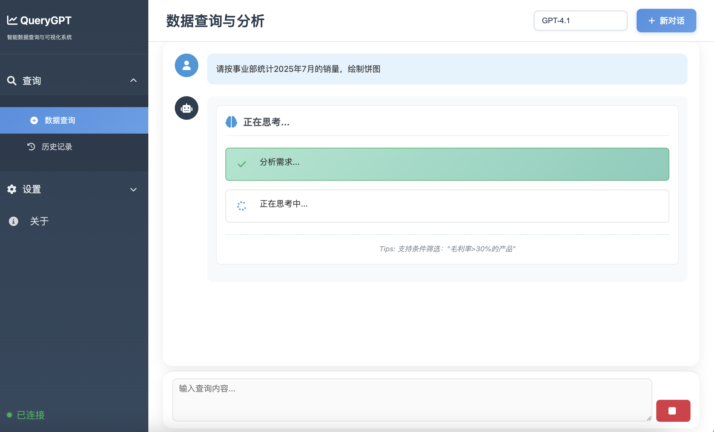
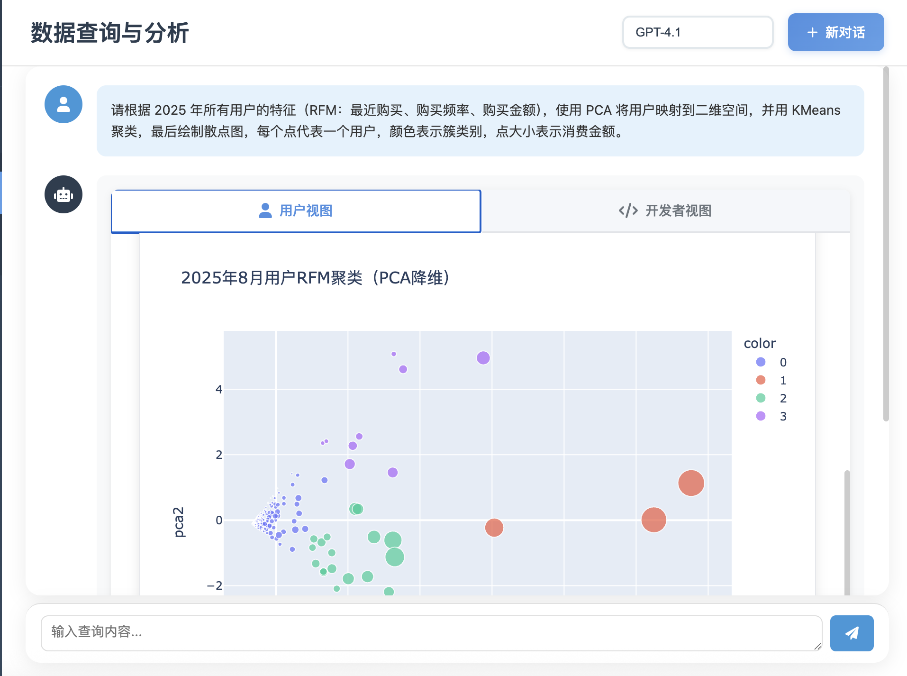

<div align="center">
  
  
  
  <br/>
  
  <p>
    <a href="#">简体中文</a> •
    <a href="docs/README_EN.md">English</a> •
    <a href="docs/README/README_ZH-TW.md">繁體中文</a> •
    <a href="docs/README/README_JA.md">日本語</a> •
    <a href="docs/README/README_ES.md">Español</a> •
    <a href="docs/README/README_FR.md">Français</a> •
    <a href="docs/README_DE.md">Deutsch</a> •
    <a href="docs/README/README_RU.md">Русский</a> •
    <a href="docs/README/README_PT.md">Português</a> •
    <a href="docs/README/README_KO.md">한국어</a>
  </p>
  
  <br/>
  
  [](LICENSE)
  [](https://www.python.org/)
  [](https://github.com/OpenInterpreter/open-interpreter)
  [](https://github.com/MKY508/QueryGPT/stargazers)
  
  <br/>
  
  <h3>基于 OpenInterpreter 的智能数据分析 Agent</h3>
  <p><i>用自然语言与数据库对话</i></p>
  
</div>

<br/>

---

## 🔥 最新更新

### 2025-08-25 - Prompt 自定义功能上线
- **🎯 可视化编辑**: 在设置页面直接编辑 AI 查询提示词
- **💾 配置管理**: 支持保存、恢复默认、导入导出配置
- **🔧 灵活定制**: 根据业务需求调整探索策略、表选择规则、字段映射等
- **🌏 多语言支持**: 完整的中英文 i18n 支持
- **✅ 实时生效**: 修改后立即应用到查询过程

> 进入 `设置` → `Prompt设置` 即可开始自定义您的 AI 助手行为！

---

## ✨ 核心优势

**像数据分析师一样思考**
- **自主探索**：遇到问题会主动查看表结构、样本数据
- **多轮验证**：发现异常会重新检查，确保结果准确
- **复杂分析**：不只是 SQL，能执行 Python 做统计分析、机器学习
- **思考可见**：实时显示 Agent 的推理过程（Chain-of-Thought）

## 📸 系统截图

<table>
  <tr>
    <td align="center">
      
      <b>实时 AI 思考过程</b>
    </td>
  </tr>
  <tr>
    <td align="center">
      
      <b>交互式数据可视化</b>
    </td>
  </tr>
  <tr>
    <td align="center">
      
      <b>透明代码执行</b>
    </td>
  </tr>
</table>

## 🌟 功能特性

### Agent 核心能力
- **自主数据探索**: Agent 会主动了解数据结构、探索数据关系
- **多轮推理迭代**: 像分析师一样，发现问题会深入调查
- **Chain-of-Thought**: 实时展示 Agent 思考过程，可随时介入纠正
- **上下文记忆**: 理解对话历史，支持连续多轮分析

### 数据分析能力
- **SQL + Python**: 不局限于 SQL，能执行复杂 Python 数据处理
- **统计分析**: 自动进行相关性分析、趋势预测、异常检测
- **中文业务术语**: 原生理解环比、同比、留存、复购等概念
- **智能可视化**: 根据数据特征自动选择最佳图表类型

### 系统特性
- **多模型支持**: GPT-5、Claude、Gemini、Ollama 本地模型随意切换
- **灵活部署**: 支持云端 API 或 Ollama 本地部署，数据永不出门
- **历史记录**: 保存分析过程，支持回溯和分享
- **数据安全**: 只读权限、SQL 注入防护、敏感数据脱敏
- **灵活导出**: 支持 Excel、PDF、HTML 等多种格式
- **Prompt 自定义**: 🆕 前端可视化编辑查询提示词，支持导入导出配置

## 📦 环境要求

- Python 3.10.x（必需，OpenInterpreter 0.4.3 依赖）
- MySQL 协议兼容的数据库（详见下方支持列表）

<br/>

## 📊 产品对比

| 对比维度 | **QueryGPT** | Vanna AI | DB-GPT | TableGPT | Text2SQL.AI |
|---------|:------------:|:--------:|:------:|:--------:|:-----------:|
| **费用** | **✅ 免费** | ⭕ 有付费版 | ✅ 免费 | ❌ 收费 | ❌ 收费 |
| **开源** | **✅** | ✅ | ✅ | ❌ | ❌ |
| **本地部署** | **✅** | ✅ | ✅ | ❌ | ❌ |
| **执行 Python 代码** | **✅ 完整环境** | ❌ | ❌ | ❌ | ❌ |
| **可视化能力** | **✅ 可编程** | ⭕ 预设图表 | ✅ 丰富图表 | ✅ 丰富图表 | ⭕ 基础 |
| **中文业务理解** | **✅ 原生** | ⭕ 基础 | ✅ 良好 | ✅ 优秀 | ⭕ 基础 |
| **Agent 自主探索** | **✅** | ❌ | ⭕ 基础 | ⭕ 基础 | ❌ |
| **实时思考展示** | **✅** | ❌ | ❌ | ❌ | ❌ |
| **扩展能力** | **✅ 无限扩展** | ❌ | ❌ | ❌ | ❌ |

### 我们的核心差异
- **完整 Python 环境**：不是预设功能，而是真正的 Python 执行环境，可以写任何代码
- **无限扩展性**：需要新功能？直接安装新库，不用等产品更新
- **Agent 自主探索**：遇到问题会主动调查，不是简单的单次查询
- **思考过程透明**：实时看到 AI 在想什么，可以随时介入指导
- **真正免费开源**：MIT 协议，没有任何付费墙

## 🚀 快速开始

### 环境要求
```bash
# Python 3.10.x (必需)
python --version  # 应显示 3.10.x

# MySQL 或兼容数据库
mysql --version
```

### 安装步骤

#### 1. 克隆项目
```bash
git clone https://github.com/MKY508/QueryGPT.git
cd QueryGPT
```

#### 2. 安装依赖
```bash
# 创建虚拟环境（推荐）
python -m venv venv
source venv/bin/activate  # Linux/Mac
# 或
venv\Scripts\activate  # Windows

# 安装依赖
pip install -r requirements.txt
```

#### 3. 配置系统

创建 `.env` 文件：
```bash
# LLM API 配置（选择一个）
OPENAI_API_KEY=your_api_key_here
OPENAI_BASE_URL=https://api.openai.com/v1  # 或其他兼容 API

# 数据库配置
DB_HOST=localhost
DB_PORT=3306
DB_USER=your_username
DB_PASSWORD=your_password
DB_NAME=your_database  # 可选，留空支持跨库查询
```

#### 4. 启动系统
```bash
# 快速启动
./quick_start.sh

# 或手动启动
python backend/app.py
```

访问 `http://localhost:5000` 开始使用！

## 🐳 Docker 部署

```bash
# 使用 docker-compose（推荐）  ps:但可能有点问题,因为作者对docker部署不太熟练都是跟着gpt学的
docker-compose up -d

# 或单独运行
docker build -t querygpt .
docker run -p 5000:5000 --env-file .env querygpt
```

## 💡 使用示例

### 基础查询(后续会改进路由系统)       
- "显示最近一个月的销售数据"
- "分析产品类别的销售占比"
- "查找销售额最高的前10个客户"

### 高级分析
- "对比今年和去年同期的销售增长"
- "预测下个季度的销售趋势"
- "找出异常的订单数据"
- "分析客户购买行为模式"

### 复杂任务
- "生成月度销售报告，包含环比、同比和趋势图"
- "分析客户流失原因并给出建议"
- "构建 RFM 客户分层模型"

## 🔧 配置说明

### 支持的模型
- **OpenAI**: GPT-5, GPT-4.1(经济)
- **Anthropic**: Claude 4 Opus, Sonnet(评分最高,最智能的模型,调用工具频繁)
- **Google**: Gemini 2.5pro(litellm可能兼容性有点问题)
- **国产模型**:qwen,deepseek(包括思考模型,但不建议)
- **本地模型**: 通过 Ollama 支持 Llama, Mistral, Qwen 等(基准线为qwen2.5 7b以上,否则代码能力几乎不支持完成agent过程)

### 数据库支持

系统使用标准 MySQL 协议，支持以下数据库：

#### ✅ 完全兼容
- **Apache Doris** / **StarRocks** - OLAP 分析型数据库（推荐用于大数据分析）
- **MySQL 5.7+** / **MariaDB 10.3+** - 传统关系型数据库
- **TiDB** - 分布式 NewSQL 数据库
- **OceanBase** - 分布式数据库（MySQL 模式）
- **PolarDB** - 阿里云原生数据库

#### ⚠️ 需要注意
- 本系统使用**只读查询**（SELECT、SHOW、DESCRIBE）
- 不依赖存储过程、触发器、外键等特性
- 支持跨库查询（配置时不指定数据库名即可）

#### 🔧 连接配置
```bash
# .env 配置示例
DB_HOST=localhost
DB_PORT=9030      # Doris/StarRocks: 9030, MySQL: 3306, TiDB: 4000
DB_USER=root
DB_PASSWORD=your_password
DB_NAME=          # 留空支持跨库查询
```

## 📚 文档

- [完整文档](docs/)
- [API 文档](docs/API.md)
- [部署指南](docs/DEPLOYMENT.md)
- [常见问题](docs/FAQ.md)
- [配置说明](docs/CONFIGURATION.md)

## 🤝 贡献

欢迎提交 Issue 和 Pull Request！

## 📄 许可证

MIT License - 详见 [LICENSE](LICENSE)

## 🙏 致谢

- [OpenInterpreter](https://github.com/OpenInterpreter/open-interpreter) - 核心 AI 引擎
- [Flask](https://flask.palletsprojects.com/) - Web 框架
- [Plotly](https://plotly.com/) - 数据可视化

## 📧 联系方式

- GitHub Issues: [提交问题](https://github.com/MKY508/QueryGPT/issues) 
- Email: mky369258@gmail.com
- 这是作者第一个作品,有任何疑问或者可能需要的改动,都可以提交issue或者pr,我会尽可能进行调整

## ⭐ Star History

<div align="center">
  <a href="https://star-history.com/#MKY508/QueryGPT&Date">
    <picture>
      <source media="(prefers-color-scheme: dark)" srcset="https://api.star-history.com/svg?repos=MKY508/QueryGPT&type=Date&theme=dark" />
      <source media="(prefers-color-scheme: light)" srcset="https://api.star-history.com/svg?repos=MKY508/QueryGPT&type=Date" />
      
    </picture>
  </a>
</div>

---

<div align="center">
  <sub>如果觉得有用，请给个 ⭐ Star 支持一下！</sub>
</div>
