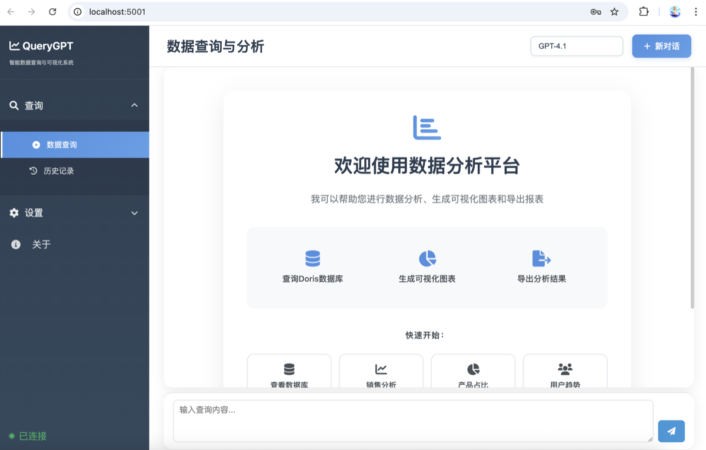

<div align="center">
  
  <br/>
  
  <p>
    <a href="README.md">English</a> •
    <a href="docs/README_CN.md">简体中文</a> •
    <a href="#">繁體中文</a>
  </p>
  
  <br/>
  
  [](LICENSE)
  [](https://www.python.org/)
  [](https://github.com/OpenInterpreter/open-interpreter)
  [](https://github.com/MKY508/QueryGPT/stargazers)
  
  <br/>
  
  <h1>QueryGPT</h1>
  <h3>基於 OpenInterpreter 的智慧數據分析系統</h3>
  <p><i>用自然語言與您的數據庫對話，支援10種語言的AI驅動數據分析平台</i></p>
  
</div>

<br/>

---

## ✨ 核心優勢

**像數據分析師一樣思考的 AI Agent**

QueryGPT 不僅僅是一個 SQL 生成工具，而是一個能夠自主思考和探索的智慧數據分析助手：

- **🔍 自主探索能力**：遇到問題會主動查看表結構、樣本數據，像專業分析師一樣深入調查
- **🔄 多輪推理驗證**：發現異常會重新檢查，通過多輪驗證確保結果準確性
- **🐍 雙引擎分析**：不僅限於 SQL，能執行 Python 進行統計分析、機器學習等複雜運算
- **💭 透明思考過程**：實時顯示 AI 的推理過程（Chain-of-Thought），可隨時介入指導
- **🌐 多語言支援**：原生支援繁體中文、簡體中文、英文等10種語言介面

## 🌟 主要功能特點

### 智慧分析核心
- **自然語言轉 SQL**：用中文描述需求，自動生成優化的 SQL 查詢語句
- **上下文理解**：記憶對話歷史，支援連續多輪深度分析
- **業務術語理解**：原生理解年增率、月增率、留存率、復購率等商業概念
- **異常檢測**：自動識別數據異常並主動提醒

### 數據視覺化
- **智慧圖表選擇**：根據數據特徵自動選擇最適合的視覺化方式
- **互動式圖表**：支援縮放、篩選、導出的動態圖表
- **多種圖表類型**：長條圖、圓餅圖、折線圖、散點圖、熱力圖等
- **自訂樣式**：可調整顏色、標籤、圖例等視覺元素

### 系統特性
- **多模型支援**：靈活切換 GPT-5、Claude、Gemini、Ollama 等模型
- **本地部署**：支援完全離線部署，數據永不外洩
- **歷史記錄**：保存所有分析過程，支援回溯和分享
- **數據安全**：唯讀權限、SQL 注入防護、敏感數據遮罩
- **靈活匯出**：支援 Excel、PDF、HTML、CSV 等多種格式

## 🛠 技術架構

### 後端技術
- **Python 3.10+**：核心運行環境（OpenInterpreter 0.4.3 依賴）
- **Flask**：Web 應用框架
- **OpenInterpreter**：自主代碼執行引擎
- **MySQL/PostgreSQL**：數據庫支援

### 前端技術
- **現代化 UI**：響應式設計，支援深色模式
- **即時更新**：WebSocket 實時顯示分析進度
- **多語言 i18n**：10種語言無縫切換

### 安全機制
- **唯讀查詢**：僅支援 SELECT、SHOW、DESCRIBE 操作
- **SQL 過濾**：自動攔截危險 SQL 語句
- **權限隔離**：數據庫用戶配置唯讀權限
- **加密傳輸**：支援 HTTPS 安全連接

## 📸 系統截圖

<table>
  <tr>
    <td width="50%">
      <strong>🤖 智慧Agent思考過程</strong><br/>
      
      <p align="center">透明的思考鏈展示，理解AI如何分析您的查詢</p>
    </td>
    <td width="50%">
      <strong>📊 數據視覺化</strong><br/>
      
      <p align="center">智慧圖表生成，自動選擇最佳展示方式</p>
    </td>
  </tr>
  <tr>
    <td width="50%">
      <strong>👨‍💻 開發者視圖</strong><br/>
      
      <p align="center">完整的執行細節，SQL語句和程式碼透明可見</p>
    </td>
    <td width="50%">
      <strong>🌐 多語言支援</strong><br/>
      
      <p align="center">支援10種語言，全球用戶無障礙使用</p>
    </td>
  </tr>
</table>

## 🚀 快速開始

### 系統要求
- Python 3.10.x（必需，OpenInterpreter 0.4.3 依賴）
- MySQL 5.7+ 或 PostgreSQL 12+
- 4GB+ RAM（建議 8GB）
- macOS、Linux 或 Windows 10+

### 安裝步驟

#### 首次使用

```bash
# 1. 複製專案
git clone https://github.com/MKY508/QueryGPT.git
cd QueryGPT

# 2. 執行設置腳本（自動配置環境）
./setup.sh

# 3. 配置環境變數
cp .env.example .env
# 編輯 .env 文件，設置您的 API 金鑰和數據庫連接

# 4. 啟動服務
./start.sh
```

#### 日常使用

```bash
# 快速啟動
./quick_start.sh
```

服務預設運行在 http://localhost:5000

> **注意**：如果 5000 埠被佔用（如 macOS AirPlay），系統會自動選擇下一個可用埠（5001-5010）

## 📝 使用說明

### 基本查詢範例

1. **銷售分析**
   - "顯示本月的總銷售額"
   - "比較去年同期的銷售成長率"
   - "找出銷售前10名的產品"

2. **客戶分析**
   - "分析客戶的地區分布"
   - "計算客戶的平均消費金額"
   - "找出VIP客戶的消費模式"

3. **趨勢預測**
   - "預測下個月的銷售趨勢"
   - "分析產品銷售的季節性變化"
   - "識別異常的銷售數據"

### 進階功能

#### 自訂模型配置

在 `config/models.json` 中添加自訂模型：

```json
{
  "name": "自訂模型",
  "id": "custom-model",
  "api_base": "http://localhost:11434/v1",
  "api_key": "your-key"
}
```

#### 本地模型部署

使用 Ollama 部署本地模型：

```bash
# 安裝 Ollama
curl -fsSL https://ollama.ai/install.sh | sh

# 下載模型
ollama pull qwen2.5

# 配置 QueryGPT 使用本地模型
# 在 config 中設置 api_base 為 http://localhost:11434/v1
```

#### 語義層配置（選用）

語義層幫助系統更好地理解您的業務術語：

```bash
# 複製範例文件
cp backend/semantic_layer.json.example backend/semantic_layer.json

# 根據您的業務需求修改配置
```

## 📊 產品比較

| 功能對比 | **QueryGPT** | 競品 A | 競品 B | 競品 C |
|---------|:------------:|:------:|:------:|:------:|
| **開源免費** | ✅ 完全免費 | ⭕ 有付費版 | ❌ 收費 | ❌ 收費 |
| **繁體中文** | ✅ 原生支援 | ⭕ 基礎 | ❌ 不支援 | ⭕ 基礎 |
| **本地部署** | ✅ 支援 | ⭕ 部分 | ❌ | ❌ |
| **Python執行** | ✅ 完整環境 | ❌ | ❌ | ❌ |
| **AI自主探索** | ✅ 進階 | ⭕ 基礎 | ❌ | ❌ |
| **即時思考顯示** | ✅ | ❌ | ❌ | ❌ |
| **多語言支援** | ✅ 10種 | ⭕ 3種 | ⭕ 2種 | ⭕ 英文 |

## 🔒 安全注意事項

- ✅ 僅支援唯讀查詢操作
- ✅ 自動過濾危險 SQL 語句
- ✅ 建議配置專用唯讀數據庫帳戶
- ✅ 支援敏感數據自動遮罩
- ✅ 所有操作都有完整審計日誌

## ❓ 常見問題

**Q：如何處理數據庫連接失敗？**  
A：檢查數據庫服務狀態，確認 .env 文件中的連接參數正確。

**Q：圖表無法顯示？**  
A：確保 output 目錄有寫入權限，檢查瀏覽器是否封鎖本地文件存取。

**Q：如何提高查詢準確度？**  
A：配置語義層幫助系統理解業務術語；提供更詳細的查詢描述。

**Q：支援哪些數據庫？**  
A：目前支援 MySQL、PostgreSQL、MariaDB，未來將支援更多。

## 🤝 貢獻指南

歡迎提交 Issue 和 Pull Request！

1. Fork 本專案
2. 創建您的功能分支 (`git checkout -b feature/AmazingFeature`)
3. 提交您的更改 (`git commit -m 'Add some AmazingFeature'`)
4. 推送到分支 (`git push origin feature/AmazingFeature`)
5. 開啟一個 Pull Request

## 📄 授權條款

本專案採用 MIT 授權條款 - 詳見 [LICENSE](LICENSE) 文件

## 👨‍💻 作者資訊

- **作者**：毛凱岳 (Mao Kaiyue)
- **GitHub**：[@MKY508](https://github.com/MKY508)
- **專案創建**：2025年8月

## 🙏 致謝

感謝所有為本專案做出貢獻的開發者和使用者！

特別感謝：
- OpenInterpreter 團隊提供的核心執行引擎
- 所有提供反饋和建議的社群成員

---

<div align="center">
  
  **QueryGPT - 讓數據分析變得簡單而強大**
  
  如果您覺得這個專案有幫助，請給我們一個 ⭐ Star！
  
</div>