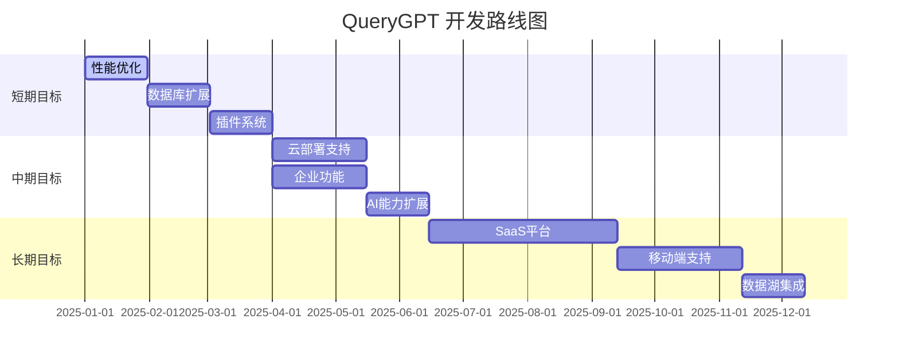

# QueryGPT 产品路线图

## 📌 项目愿景

QueryGPT 致力于成为企业级的自然语言数据分析平台，让每个人都能通过对话方式轻松查询和分析数据，无需SQL知识。我们的目标是打破数据分析的技术壁垒，让数据洞察触手可及。

### 核心价值主张
- 🎯 **零门槛数据分析** - 用自然语言替代SQL查询
- 🚀 **即时洞察** - 秒级响应，实时可视化
- 🔐 **企业级安全** - 完善的权限管理和数据保护
- 🌐 **全场景覆盖** - 支持多种数据源和部署方式

---

## ✅ 已完成功能

### 核心功能
- ✔️ 自然语言转SQL查询引擎
- ✔️ 多轮对话上下文理解
- ✔️ 智能数据可视化（图表自动推荐）
- ✔️ 查询结果缓存机制
- ✔️ 会话历史管理
- ✔️ 实时流式响应

### 技术基础
- ✔️ OpenAI GPT集成
- ✔️ MySQL/Doris数据库支持
- ✔️ Web界面（响应式设计）
- ✔️ RESTful API接口
- ✔️ Docker容器化部署
- ✔️ 基础性能监控

---

## 🎯 短期目标（1-3个月）

### 第1个月：性能优化与稳定性提升
- [ ] **查询性能优化**
  - 实现智能查询优化器
  - 并行查询执行引擎
  - 查询结果预加载
- [ ] **缓存系统升级**
  - Redis分布式缓存
  - 智能缓存预热
  - 缓存命中率优化至95%+

### 第2个月：数据库生态扩展
- [ ] **更多数据库支持**
  - PostgreSQL集成
  - ClickHouse支持
  - MongoDB连接器
  - Elasticsearch集成
- [ ] **数据源管理**
  - 多数据源切换
  - 数据源配置界面
  - 连接池优化

### 第3个月：插件系统架构
- [ ] **插件框架**
  - 插件API设计
  - 插件市场原型
  - 示例插件开发
- [ ] **第三方集成**
  - Excel/CSV导入导出
  - API数据源接入
  - Webhook通知

---

## 🚀 中期目标（3-6个月）

### 第4-5个月：云原生与企业功能
- [ ] **云部署支持**
  - Kubernetes部署方案
  - AWS/阿里云/腾讯云适配
  - 自动扩缩容
  - 多租户架构
- [ ] **企业级功能**
  - LDAP/SSO集成
  - 细粒度权限管理
  - 审计日志系统
  - 数据脱敏处理

### 第6个月：AI能力扩展
- [ ] **多模型支持**
  - Claude集成
  - 文心一言支持
  - 通义千问接入
  - 本地大模型部署（Llama）
- [ ] **智能分析增强**
  - 异常检测
  - 趋势预测
  - 智能报表生成
  - 数据质量检查

---

## 🌟 长期目标（6-12个月）

### 第7-9个月：SaaS服务化
- [ ] **SaaS平台**
  - 多租户SaaS架构
  - 计费系统
  - 用户管理后台
  - API限流与配额
- [ ] **商业化功能**
  - 订阅管理
  - 使用量统计
  - 发票系统
  - 客户支持系统

### 第10-11个月：移动端支持
- [ ] **移动应用**
  - iOS原生应用
  - Android原生应用
  - 小程序版本
  - 移动端优化API
- [ ] **离线功能**
  - 离线查询缓存
  - 数据同步机制
  - 推送通知

### 第12个月：大数据生态集成
- [ ] **数据湖支持**
  - Hadoop/HDFS集成
  - Spark SQL支持
  - Presto/Trino连接
  - Delta Lake/Iceberg
- [ ] **实时分析**
  - Kafka流处理
  - Flink集成
  - 实时仪表板
  - 告警系统

---

## 📊 开发时间线

---

## 🎖️ 里程碑

| 时间节点 | 里程碑 | 关键成果 |
|---------|--------|---------|
| 2025 Q1 | v2.0 性能版 | 查询性能提升10倍，支持5+数据库 |
| 2025 Q2 | v3.0 企业版 | 企业级功能完备，云原生部署 |
| 2025 Q3 | v4.0 SaaS版 | SaaS服务上线，移动端发布 |
| 2025 Q4 | v5.0 智能版 | 全面AI增强，大数据生态集成 |

---

## 🔄 版本发布计划

### 版本命名规则
- **主版本号**: 重大架构变更或功能突破
- **次版本号**: 新功能添加
- **修订号**: Bug修复和小改进

### 发布周期
- 🔥 **每周**: Bug修复版本
- 📦 **每月**: 功能更新版本
- 🎯 **每季度**: 主要版本发布

---

## 📈 成功指标

### 技术指标
- 查询响应时间 < 100ms (95分位)
- 系统可用性 > 99.9%
- 并发用户支持 > 10,000
- 数据源支持 > 20种

### 业务指标
- 月活跃用户 > 100,000
- 企业客户 > 500家
- 用户满意度 > 4.5/5
- 社区贡献者 > 1,000人

---

## 🤝 参与贡献

我们欢迎社区参与！以下是您可以贡献的方式：

1. **提交Issue**: 报告bug或提出新功能建议
2. **Pull Request**: 直接贡献代码
3. **文档改进**: 帮助完善文档
4. **插件开发**: 开发和分享插件
5. **社区支持**: 在论坛帮助其他用户

---

## 📮 联系我们

- 📧 Email: contact@querygpt.io
- 💬 Discord: [加入我们的社区](https://discord.gg/querygpt)
- 🐦 Twitter: [@QueryGPT](https://twitter.com/querygpt)
- 📝 Blog: [blog.querygpt.io](https://blog.querygpt.io)

---

*最后更新: 2025年1月*

> 💡 **注意**: 此路线图会根据用户反馈和市场需求持续更新。具体功能的发布时间可能会有所调整。